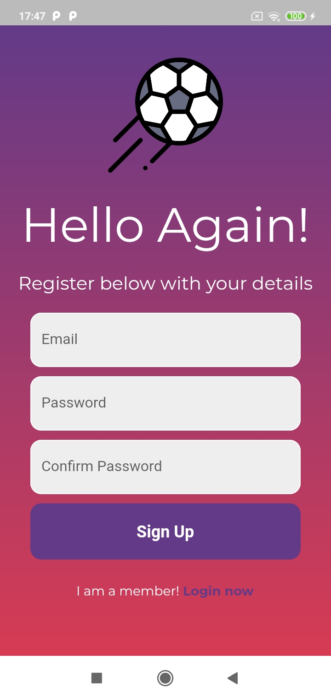
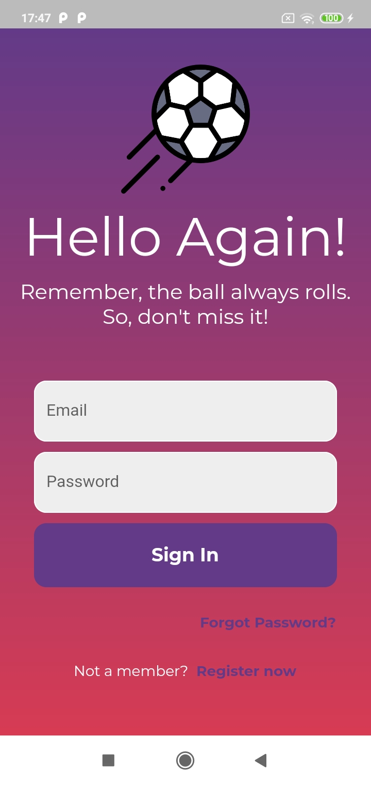
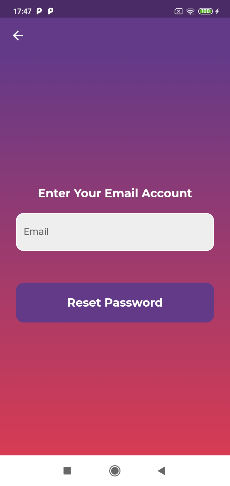
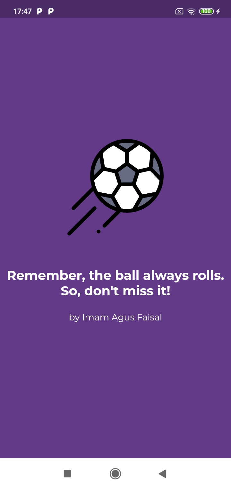
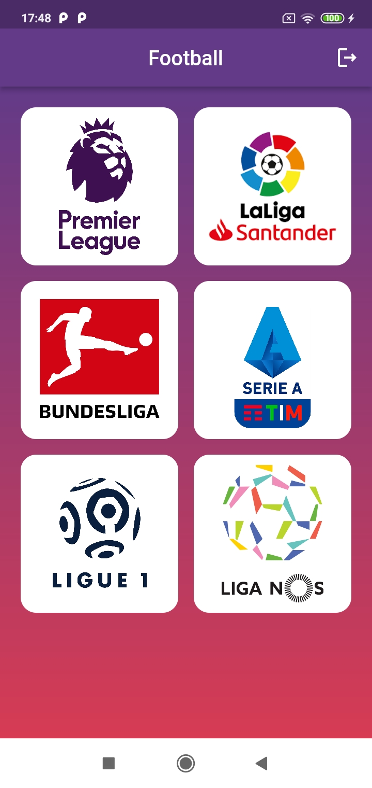
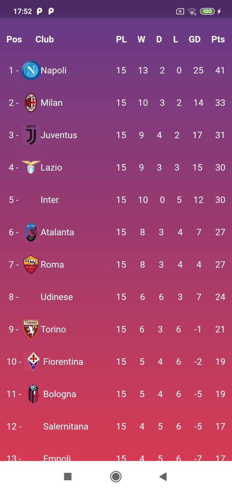
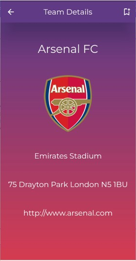
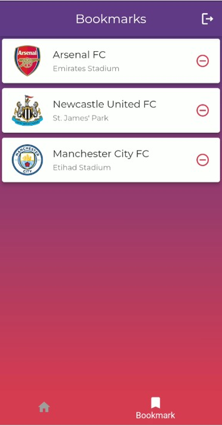

# Bola Nihh

Multi-platform app that displays European league standings and team details, with features like favorite bookmarking using Firestore and real-time data integration via football-data.org API. Implemented secure user authentication including login, registration, and password reset via email using Firebase Authentication.

## Screenshots Features

|                 Sign Up                 |                 Sign Ip                 |
| :-------------------------------------: | :-------------------------------------: |
|  |  |

 
 

|                     Reset Password                     |                    Splashcreen                    |
| :----------------------------------------------------: | :-----------------------------------------------: |
|  |  |

 
 

|                 League Selection                 |                      Leage Standings                      |
| :----------------------------------------------: | :-------------------------------------------------------: |
|  |  |

 
 

|                    Detail Team                    |                  Favorite Team                  |
| :-----------------------------------------------: | :---------------------------------------------: |
|  |  |

## Dependencies

- cupertino_icons: ^1.0.5
- google_fonts: ^3.0.1
- firebase_auth: ^4.1.3
- email_validator: ^2.1.17
- http: ^0.13.5
- flutter_svg: ^1.1.6
- flutter_launcher_icons: ^0.10.0
- animated_splash_screen: ^1.3.0
- cloud_firestore: ^4.1.0
